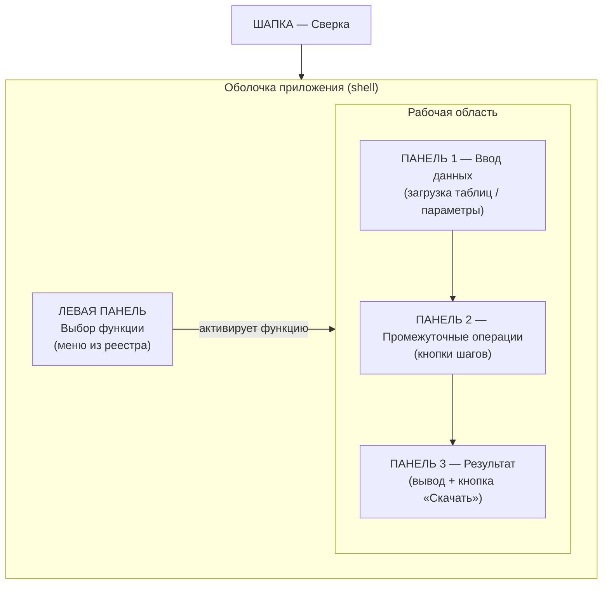
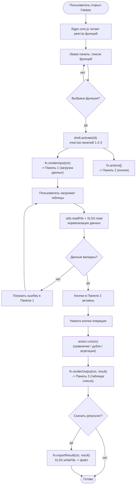
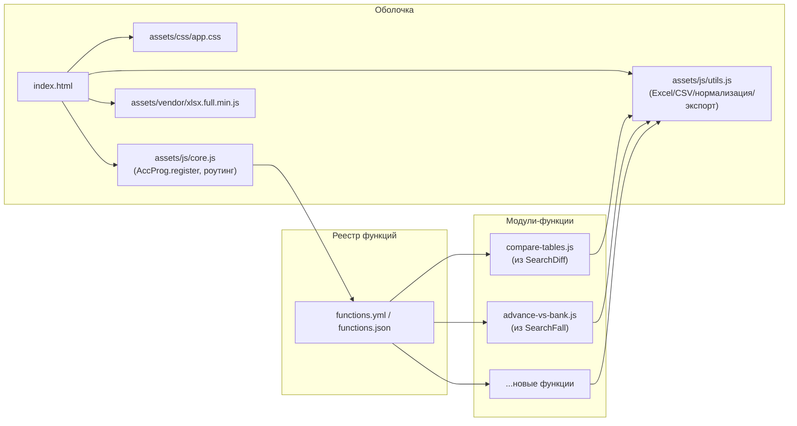
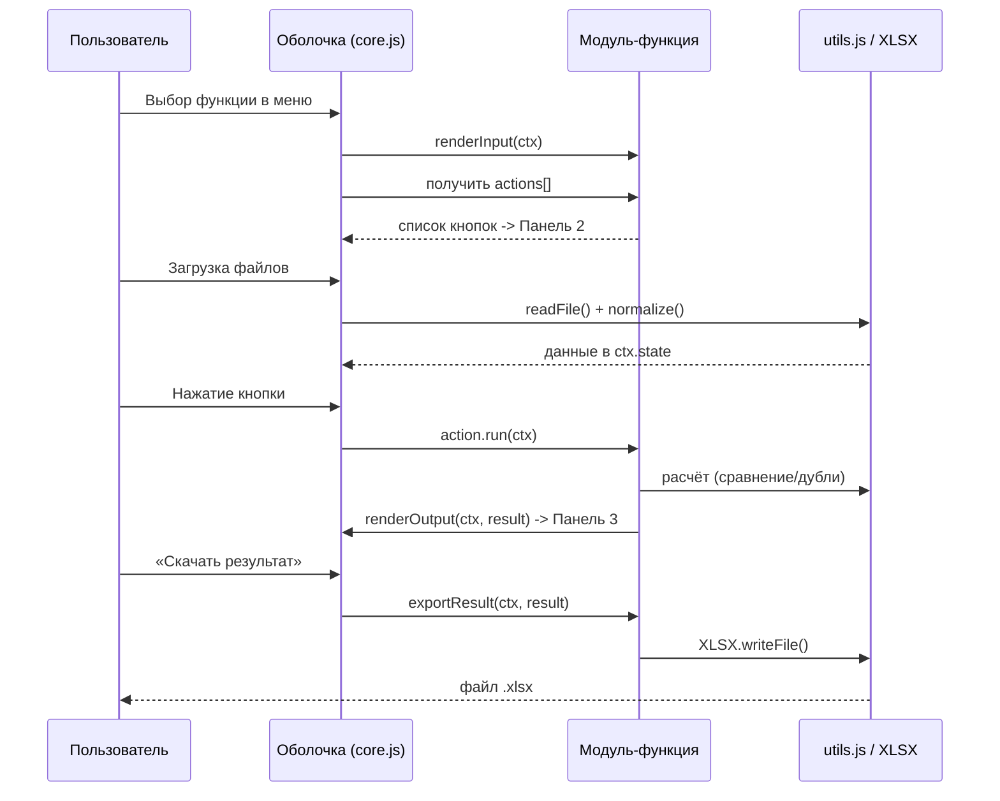
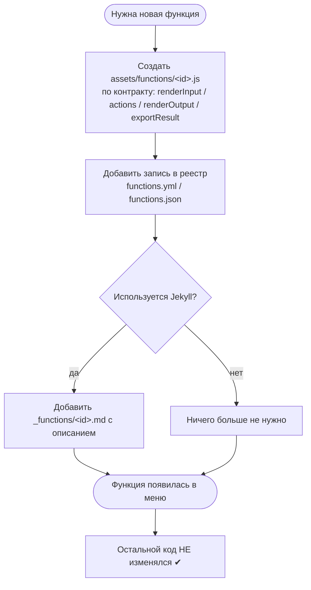

# Сверка — Блок-схемы

Диаграммы в формате **Mermaid** (отображаются на GitHub, в VS Code с расширением Mermaid,
в Obsidian и на https://mermaid.live).

---

## 1. Структура интерфейса (4 панели)

---

## 2. Сценарий работы пользователя (жизненный цикл функции)

---

## 3. Архитектура файлов и поток подключения

---

## 4. Контракт модуля и взаимодействие с оболочкой

---

## 5. Механизм расширения (как добавить функцию)

