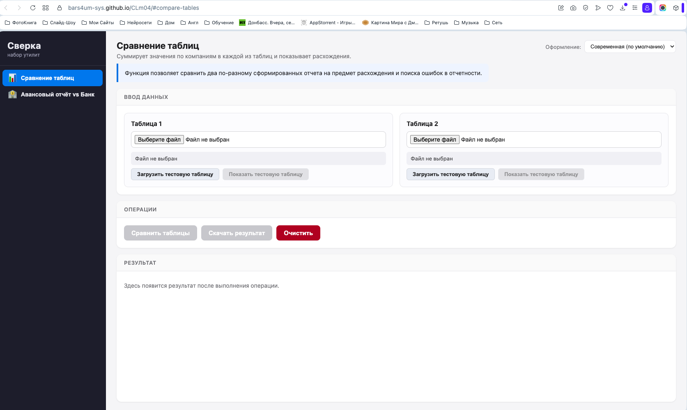
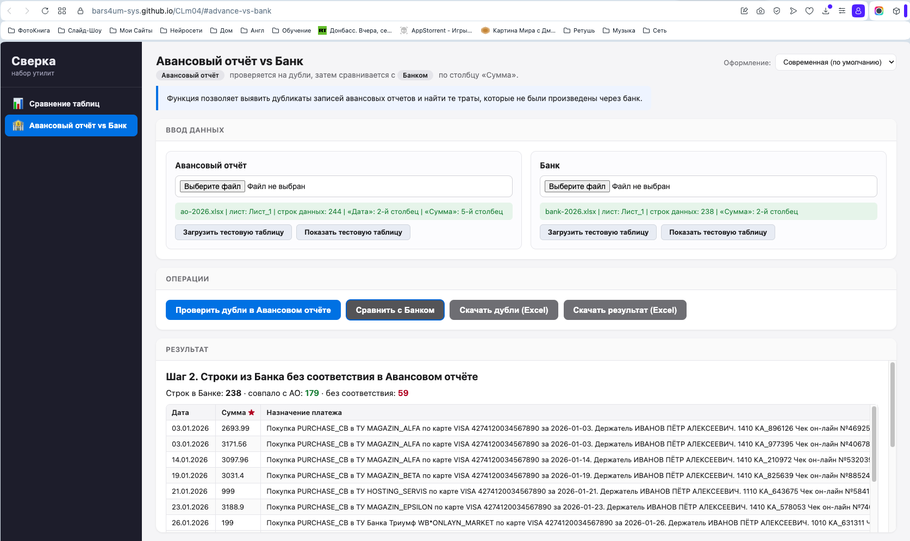
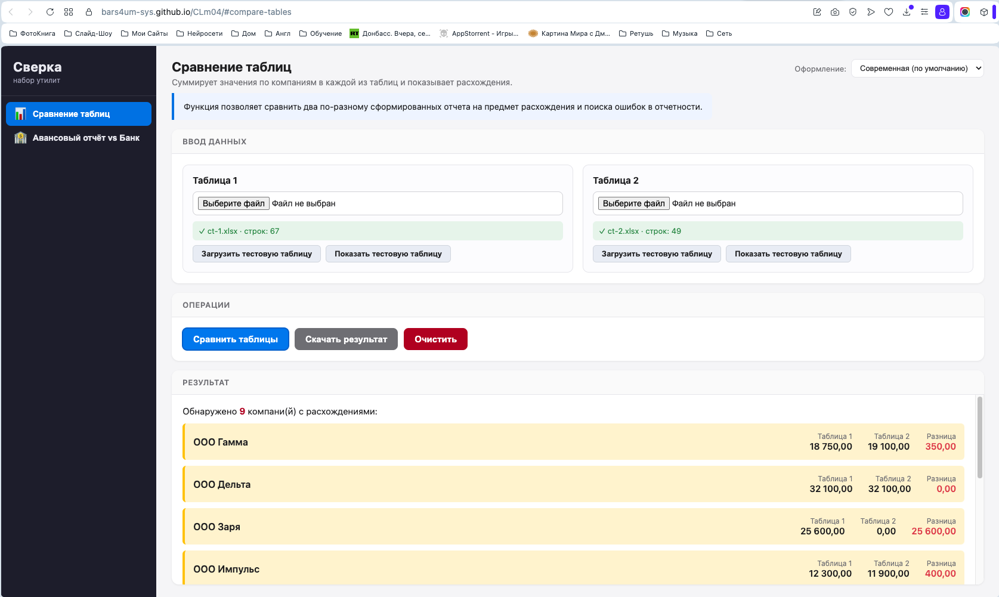

# Сверка — набор бухгалтерских утилит

Модульное веб-приложение для бухгалтеров: единая оболочка с четырьмя панелями
(меню функций, ввод данных, операции, результат). Каждая функция — независимый
модуль. Всё работает в браузере, данные никуда не отправляются.

## Функции

- **Сравнение таблиц** — суммирует значения по компаниям из двух таблиц и
  показывает расхождения (с экспортом результата в Excel).
- **Авансовый отчёт vs Банк** — поиск дублей в авансовом отчёте и сравнение
  с банком по столбцу «Сумма» (оба результата выгружаются в Excel).

## Оформление

Встроены 4 темы (переключатель в шапке): современная, «Уютная бухгалтерия»,
«Ретро-офис (Win95)», «Винтажный пастельный».

## Скриншоты


*Главная страница с меню функций*


*Результат сверки авансового отчёта с банковской выпиской*


*Результат сравнения двух таблиц*

## Онлайн-версия (GitHub Pages)

https://bars4um-sys.github.io/CLm04/

## Запуск локально

Из-за `fetch` для `functions.json` нужен локальный сервер (не открытие через `file://`):

```bash
python3 -m http.server 8000
```

Затем открыть http://localhost:8000

## Структура

```
index.html              # оболочка: 4 панели + переключатель тем
functions.json          # реестр функций
assets/
  css/app.css           # раскладка и базовые стили
  css/theme-*.css       # темы оформления
  js/core.js            # ядро: реестр, меню, роутинг
  js/utils.js           # общие утилиты (Excel/CSV/нормализация/экспорт)
  functions/*.js        # модули-функции
  vendor/xlsx.full.min.js
_legacy/                # исходные демо-приложения (референс)
```

## Документация

- `PLAN.md` — план-структура и архитектура
- `FLOWCHART.md` — блок-схемы (Mermaid)
- `REPORT.md` — отчёт о проделанной работе и инструкции для доработки

## Как добавить новую функцию

1. Создать `assets/functions/<id>.js` по контракту модуля
   (`renderInput`, `actions[]`, вывод через `ctx.setOutput`, экспорт через `ctx.utils.exportXlsx`).
2. Добавить запись в `functions.json`.

Остальной код менять не нужно.
